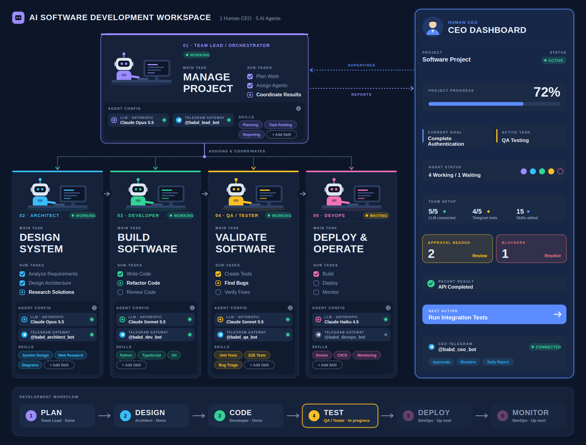
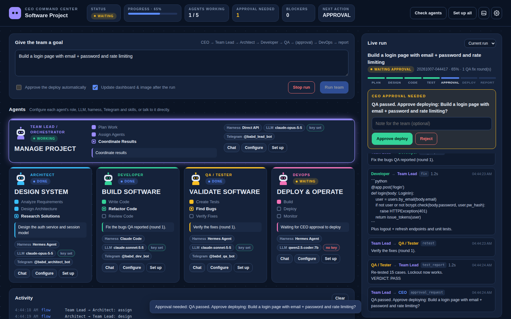
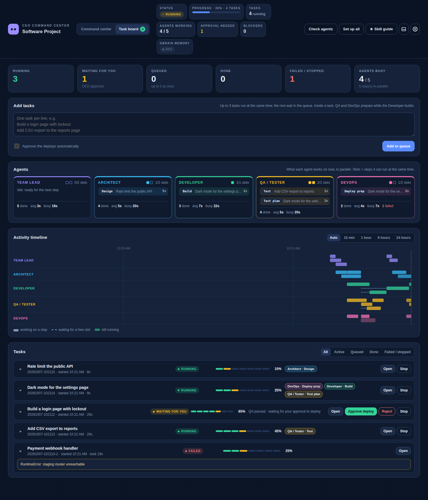

# AI Software Development Workspace

An AI software company: one human CEO supervises a team of 5 AI agents. Each agent runs on its own
harness (direct API, Hermes Agent, Claude Code, …) with its own LLM (Claude or any OpenAI-compatible
endpoint), the agents work through a fixed CEO → Team Lead → specialists flow, and a web dashboard
lets the CEO configure, command and watch them. `agents.json` drives all of it, including the
workspace illustration.



## Install

```bash
git clone https://github.com/bayu18/babd.git && cd babd
./install.sh
```

`install.sh` (Linux / macOS; on Windows use WSL) needs only Python 3.10+. It:

1. creates `.venv` and installs BABD with its Python dependencies (`anthropic`, `openai`);
2. creates `.env` (file mode 600) for API keys;
3. installs **GBrain** (the team memory: Bun 1.4+ from GitHub releases, checksum-verified, and the
   gbrain source) and creates a local brain in `.babd/gbrain`;
4. installs and configures the harness of every agent in `agents.json`: Hermes Agent into its own
   virtualenv, Claude Code with npm (BABD downloads Node.js itself, checksum-verified, when npm is
   missing), and a per-agent config for each.

Re-running it is safe. Everything BABD installs stays inside the project (`.venv/`, `.babd/`).

## Dashboard

```bash
.venv/bin/babd dashboard
```

Opens the CEO command center in your browser (`http://127.0.0.1:8800/?token=…`).



- **Animated agents**: each card has its robot at its workstation, moving with what the agent is
  really doing: idle (breathing, blinking, "z z z", a screensaver), working (typing, code scrolling on
  the monitor, sparks), waiting (head tilt, "…" bubble, hourglass), blocked (shake, red alert),
  setting up (progress bar), plus a GBrain badge with ↓ / ↑ when it reads or writes memory. Turned
  off automatically when the system asks for reduced motion.

  
- **Give the team a goal** and watch the run live: the stage stepper, every message between the
  agents, and the CEO report at the end. While tasks run you can add more ("Add task"); the run panel
  switches between the tasks running now and the history.
- **Give the task as a Markdown file**: attach `.md` files (button or drag & drop) or paste links
  to them; see [Task documents](#task-documents-md-files-and-links).
- **Task board** (tab at the top): every task and what every agent is doing, see
  [Many tasks at once](#many-tasks-at-once-and-agents-in-parallel).
- **Approve or reject the deploy** when QA has passed (or tick "approve automatically").
- **Configure each agent**: role and tasks, LLM (provider, API style, base URL, model, effort,
  API key), harness and its options, Telegram, skills. Saving writes `agents.json`, redraws the
  workspace image, and **Save & set up** installs and configures the harness right away.
  API keys typed here go to `.env` under the agent's key variable, never to `agents.json`, and
  are never sent back to the browser.
- **Chat with one agent** directly through its harness.
- **Check agents** (send each a short test message), **Set up all**, team settings (project name,
  CEO approval before deploy, QA fix rounds, tasks at the same time, parallel preparation), run
  history, and an activity log with install output.

The panel listens on 127.0.0.1 only. Every API call needs the token from the start-up URL, and the
Host header must be the panel's own address, so other web pages can't drive it.

## Team memory: GBrain

Every agent has the **GBrain** skill ([garrytan/gbrain](https://github.com/garrytan/gbrain)) and
uses it on every task, enforced by BABD around each step rather than left to the model:

```
read  gbrain recall  (keywords of the goal + the task)  ->  "Team memory (gbrain)" at the top of the prompt
work  the agent does the task with that memory
write gbrain put     babd/runs/<run>/<nn>-<agent>-<kind>   (the agent's full output as a page)
      gbrain remember "<one-line fact>" --entity babd/goals/<goal> --provenance "babd run <run> · <agent> · <kind>"
```

This holds for every step of a team run (plan, design, code, test, fix, deploy, report) and for
direct chats. So the next agent, and the next run, starts from what the team already decided: a new
goal's plan reads the earlier designs, QA verdicts and CEO reports. Agents with tools (Hermes, Claude
Code) also get the `gbrain` command and `GBRAIN_HOME` to search or save more themselves; the skill's
instructions are in `skills/gbrain.md`.

It runs **locally and keyless**: a PGLite brain (embedded Postgres, no server, no Docker) with keyword
search and no embeddings. BABD strips cloud API keys from gbrain's environment, including when an
agent calls `gbrain` itself, so no memory text leaves the machine (`allow_cloud: true` changes that).

| `project.gbrain` | Meaning |
| --- | --- |
| `enabled` | Read before / write after every agent step (default `true`) |
| `strict` | A failed gbrain read or write stops that step with a clear error (default `true`). `false`: carry on without memory |
| `allow_cloud` | Pass cloud API keys to gbrain, e.g. for embeddings or fact extraction (default `false`) |
| `home` | Where the brain lives (default `.babd/gbrain`, i.e. `GBRAIN_HOME`) |
| `ref` | gbrain git ref to install (default `latest-stable`) |
| `budget_tokens` | How much memory one recall may put in a prompt (default 1200) |
| `command` | Use an existing `gbrain` program instead of installing one |

```bash
babd brain                     # status
babd brain login lockout       # what the team knows about these words
```

The dashboard shows each read and write in the run timeline, has a **Team memory** search, a GBrain
status in the top bar, and the GBrain settings under Team settings.

When the project folder is a git checkout, the brain is created with `gbrain init --git` (otherwise
gbrain refuses with `local_conflict`). A brain that was half-made by an earlier failed setup is moved
aside to `.gbrain.failed-<time>` and created again; a working brain is never touched.

## Skills: Superpowers and Matt Pocock's skills

Two skill packs are vendored, unmodified, and run **locally** (nothing is downloaded at run time):

| Pack | Folder | Source |
| --- | --- | --- |
| Superpowers (15 skills) | `skills/superpowers/` | [obra/superpowers](https://github.com/obra/superpowers), MIT |
| Matt Pocock's skills (38 skills) | `skills/mattpocock/` | [mattpocock/skills](https://github.com/mattpocock/skills), MIT |

Each folder has the `LICENSE`, a `SOURCE.md` with the exact commit, and an `ADAPTATION.md` that tells
the agents how the skills map onto this team ("the user" is the CEO through the Team Lead, sub-agents
are the other agents, questions go under **Open questions** with a recommended answer instead of
stopping, results not actually observed are marked **NOT RUN**).

### Recommended skills per agent

Each agent gets the skills its role needs. The dashboard marks them **★ Recommended**; everything else
is **Optional** (available to tick, not needed for the role).

| Agent | Superpowers | Matt Pocock's skills |
| --- | --- | --- |
| Team Lead | using-superpowers, brainstorming, writing-plans, subagent-driven-development, dispatching-parallel-agents, requesting-code-review, verification-before-completion, finishing-a-development-branch, diagnosing-superpowers, writing-skills | grilling, to-spec, to-tickets, implement-spec, triage, wayfinder, chief-of-staff, handoff, to-questionnaire, wait-what, retro, writing-for-agents, ask-matt |
| Architect | using-superpowers, brainstorming, writing-plans, dispatching-parallel-agents | grilling, domain-modeling, codebase-design, improve-codebase-architecture, prototype, research, to-spec |
| Developer | using-superpowers, test-driven-development, executing-plans, systematic-debugging, receiving-code-review, verification-before-completion, using-git-worktrees | implement, tdd, codebase-design, diagnosing-bugs, prototype, pr, research |
| QA / Tester | using-superpowers, test-driven-development, systematic-debugging, requesting-code-review, verification-before-completion | tdd, code-review, diagnosing-bugs, triage |
| DevOps | using-superpowers, verification-before-completion, finishing-a-development-branch, using-git-worktrees, systematic-debugging | wizard, diagnosing-bugs, pr, setup-pre-commit |

Matt Pocock's skills that no agent gets by default, and why (see `babd/mattpocock.py`): `grill-me` and
`grill-with-docs` only call grilling / domain-modeling, which are given directly;
`setup-matt-pocock-skills` is done by BABD itself; `claude-handoff` and `git-guardrails-claude-code`
change a machine's Claude Code setup; `setup-ts-deep-modules` and `migrate-to-shoehorn` are
TypeScript-only; `scaffold-exercises`, `teach`, `loop-me` and the three `writing-*` skills are not
about software delivery.

The basic skills (the short names on each card, e.g. `Python`, `Docker`) also have recommended ones
per role, starting with **GBrain** for everyone.

Where you see it:

- **Agent card**: a `★ Recommended 18/18 ✓` chip, amber with `· fix` when a recommended skill is off.
  Click it to open the agent's Skills tab.
- **Skills tab** (Configure → Skills): a summary ("11 of 13 recommended skills are on"), a **Turn on
  all recommended** button, recommended basic skills you can add with one click, and per pack the
  recommended skills first (each with a plain-language line on what it does for you and the steps it
  is used in) and the optional ones folded away.
- **★ Skill guide** (top bar): every agent with its recommended skills, ✓ on / ✗ off.
- **Workspace image**: the same `★ Recommended n/m` chip on each card.

### Always used

BABD enforces the skills around every step rather than leaving it to the model (`babd/skillpacks.py`):

- every agent's system prompt has the rule (check for a matching skill before any action) and the list
  of its skills, pack by pack;
- every step of a team run gets the **full text** of the agent's skills for that step, from both packs,
  plus each pack's `ADAPTATION.md`:

  | Step | Superpowers | Matt Pocock's skills |
  | --- | --- | --- |
  | plan | brainstorming, writing-plans, subagent-driven-development, dispatching-parallel-agents | grilling, to-spec, to-tickets |
  | design | brainstorming, writing-plans | domain-modeling, codebase-design, grilling |
  | code | test-driven-development, executing-plans, using-git-worktrees, verification-before-completion | implement, tdd, codebase-design |
  | test plan (QA, while the Developer builds) | test-driven-development | tdd |
  | deploy prep (DevOps, while the Developer builds) | verification-before-completion, using-git-worktrees | wizard, setup-pre-commit |
  | test | test-driven-development, systematic-debugging, requesting-code-review, verification-before-completion | code-review, tdd, diagnosing-bugs |
  | fix | systematic-debugging, receiving-code-review, test-driven-development, verification-before-completion | diagnosing-bugs, tdd |
  | deploy | verification-before-completion, finishing-a-development-branch, using-git-worktrees | wizard, pr |
  | report | verification-before-completion, finishing-a-development-branch (+ diagnosing-superpowers when blocked) | wait-what, retro (+ to-questionnaire when blocked) |

  (a step uses only the skills the agent has; the others stay in its catalog and are used when they fit);
- the answer must end with `Skills applied:` and one line per skill (the exact name). If one is
  missing, the agent redoes the step once; what is still missing is recorded in the run and shown with
  ⚠ in the timeline;
- agents with native skill support also get the files: Hermes in `HERMES_HOME/skills/superpowers/` and
  `HERMES_HOME/skills/mattpocock/` (`hermes skills list` shows them as local, enabled), Claude Code in
  its private config dir's `skills/` (only when BABD owns that dir; your own `~/.claude` is never
  changed).

Change an agent's skills in the dashboard or in `agents.json` (`superpowers` and `mattpocock` lists;
without a list the role's recommended skills apply). Team settings has `enabled` and `enforce` (the
redo) per pack: `project.superpowers`, `project.mattpocock`.

The skill texts make prompts larger: in a team run a step's skills add about 20–80k characters
(roughly 5–20k tokens; the largest is the Team Lead's plan), so each step costs more tokens.

## How the agents talk to each other

```
CEO ──goal──▶ Team Lead ──plan──┐
                                ├─▶ Architect ──design──▶ Team Lead
                                ├─▶ Developer ──code────────────▶ Team Lead  ┐
                                ├─▶ QA ──test plan (from design)─▶ Team Lead  ├ at the same time
                                ├─▶ DevOps ──deploy preparation──▶ Team Lead  ┘ (parallel_prep)
                                ├─▶ QA ──test report + VERDICT──▶ Team Lead
                                │      FAIL: Team Lead ─▶ Developer (fix) ─▶ Team Lead ─▶ QA (re-test)
                                │            … up to max_fix_rounds, then the run is BLOCKED
Team Lead ──approval request──▶ CEO ──approve / reject──▶ Team Lead       (require_approval: deploy)
                                └─▶ DevOps ──deploy + monitoring──▶ Team Lead   (only after PASS + approval)
Team Lead ──report──▶ CEO
```

- The Team Lead is the hub: specialists only talk to the Team Lead, and only the Team Lead talks to
  the CEO. Any other route is refused (`babd/flow.py`, `MessageBus`).
- Each agent gets the work it builds on: the Developer gets the design, QA gets design + its test
  plan + code, DevOps gets code + QA report + its deploy preparation + the CEO's approval note.
- QA must end with `VERDICT: PASS` or `VERDICT: FAIL`; a missing verdict counts as FAIL.
- The report's status, progress, approvals and blockers are computed from what happened (QA verdict,
  approval, deploy), not taken from the model.
- Every message is saved in `runs/<id>/messages.jsonl`, with `state.json` and one file per step.

## Projects: where the agents' work goes

The agents never work inside the BABD installation. Every task belongs to a **project**, and runs in
its own git worktree of that project, on a branch `babd/<task id>`:

```
workspace/projects/<project>/          the project (a git repository; created, or cloned from `repo`)
workspace/worktrees/<project>/<task>/  this task's worktree: every agent of the task works here
```

So tasks running at the same time never step on each other's files, and the project's main checkout
only changes when a task is merged. When a task ends, BABD commits what changed on its branch and,
by the project's `merge` rule, merges it into the project's branch:

| `merge` | Merged when |
| --- | --- |
| `on_approval` (default) | QA passed and you approved the deploy (or no approval is required) |
| `on_pass` | QA passed |
| `never` | never: the branch stays for you to review |

A failed or stopped task keeps its work on its branch. A merge conflict is reported, not forced.
`push: true` pushes the merged branch when the project has a remote.

Agents with tools (Hermes, Claude Code) work in the worktree directly. Agents without tools (direct
API) are asked to give each file as a fenced block whose first line is ```` ```python file=src/app.py ````;
BABD writes those files into the worktree (never outside it).

Add projects in **Team settings → Projects** (name, git URL or folder, branch, merge rule, push), pick
one per task in the goal form or task board, or on the command line with `--project <id>`. In
`agents.json`:

```json
"projects": [
  {"id": "shop", "name": "Web shop", "repo": "https://github.com/acme/shop.git", "merge": "on_approval", "push": true}
]
```

There is always a `default` project (`workspace/projects/default`). `project.use_projects: false`
turns all this off (agents then work in `workspace/`).

## Task documents (.md files and links)

Instead of typing the main task, give it as a Markdown (or text) file: a spec, a ticket, a PRD.

- **Dashboard, Command center**: *Attach .md file* (or drop files on the goal box) and/or paste a
  link. The documents go with that goal; the goal text is optional (the first document's title then
  names the task).
- **Dashboard, Task board → Add tasks**: each attached file or link (or a line with a link) becomes
  its own task, named after its first heading.
- **Command line**: a goal argument that is a `.md`/`.txt` file or a link is read as a task:

  ```bash
  .venv/bin/babd run specs/login.md https://github.com/acme/app/blob/main/docs/csv-export.md
  .venv/bin/babd run "Build what the spec says" --doc specs/login.md --doc specs/ui-notes.md
  ```

Links to a file page on GitHub, GitLab or a Gist are read from the raw file; other links must point
at the Markdown file itself (a web page is refused). Files are read as text only, up to 500 KB each.

Every agent of the run gets the full document under *Task document* in its prompt (plan, design,
build, test plan, deploy preparation, test, deploy, report), and it is saved as
`runs/<run>/00-task.md` for agents with file tools. In the dashboard the task shows its documents,
and *View document* opens what the team received.

## Many tasks at once, and agents in parallel

BABD runs several tasks (goals) at the same time, and the agents work in parallel:

- **Between tasks**: up to `project.max_parallel_tasks` tasks run at once (default 3); more wait in a
  queue and start as soon as one finishes. A task waiting for your deploy approval does not hold a
  place, so the agents keep working on other tasks meanwhile. While task A is being tested, task B
  can be designed and task C built.
- **Inside a task**: once the design is ready, the Developer builds while QA writes the test plan
  from the design and DevOps prepares the deployment (`project.parallel_prep`, default on). QA then
  tests the build against its plan, and DevOps deploys from its preparation.
- **Per agent**: `parallel` in `agents.json` (default 2, 1–8) is how many steps one agent works on
  at the same time, across all tasks. A step that finds the agent busy waits for a free slot, and
  the dashboard shows it as *waiting for a free slot*. Set it to 1 for an agent on a local model that
  can only answer one request at a time.

Messages, run state and GBrain writes are safe with steps running at the same time (one lock per
run; GBrain calls go one at a time). The CEO approval is asked per task.

**Task board** (the *Task board* tab in the dashboard):



- tiles: running, waiting for you, queued, done, failed or stopped, agents busy;
- **Add tasks**: one per line, all queued at once;
- **Agents**: per agent its slots (busy / total), the steps it works on now with a live timer, steps
  waiting for a free slot, and how many steps it finished, its average step time and busy time;
- **Activity timeline**: one row per agent, a bar per step (steps at the same time on separate
  lines), dashed lines while a step waited for a slot; hover a bar for the task, step and times, click
  it to open the task. Range: auto, 15 min, 1 hour, 6 hours, 24 hours;
- **Tasks**: every task with its status, stage progress, who works on it now, how long it has run,
  and Open / Approve deploy / Reject / Stop (or Remove from the queue); expand a task for its steps
  with how long each one waited and took.

From the command line, give several goals to run them at the same time:

```bash
.venv/bin/babd run "Build a login page" "Add CSV export to reports" --approve
```

| Setting | Where | Default |
| --- | --- | --- |
| `project.max_parallel_tasks` | Team settings → Tasks at the same time | 3 |
| `project.parallel_prep` | Team settings → QA and DevOps prepare while the Developer builds | on |
| `agents[].parallel` | Configure → Role → Parallel steps | 2 |

Running in parallel does not make a task cheaper: parallel preparation adds two LLM steps per task
(QA's test plan, DevOps' preparation), and more tasks at once means more LLM calls at the same time.

## Files

| File | Description |
| --- | --- |
| `install.sh` | One-command install (see above) |
| `workspace.svg` | The illustration as a scalable vector (1920×1802) |
| `workspace.png` | The same image rendered as a PNG |
| `agents.json` | **Configuration** for each agent (LLM, harness, Telegram bot, skills, tasks, status) and for the CEO dashboard and flow |
| `generate_workspace.py` | Script that reads `agents.json` and writes `workspace.svg` |
| `babd/` | The runtime: LLM clients, harnesses (`harness/`), team flow (`flow.py`), team memory (`gbrain.py`), skill packs (`skillpacks.py`, `superpowers.py`, `mattpocock.py`), dashboard (`dashboard/`) and the command line |
| `skills/` | Instruction files for skills (see `skills/README.md`); `skills/superpowers/` and `skills/mattpocock/` hold the vendored skill packs |
| `tests/` | Tests: GBrain read/write around every step (fake gbrain CLI), the flow with scripted agents, the dashboard API over HTTP, real HTTP calls through both SDKs to a mock LLM server, and fake `hermes` / `claude` CLIs |

## Command line

```bash
source .venv/bin/activate        # or prefix the commands with .venv/bin/

babd dashboard                                # web panel
babd check                                    # ping every agent through its harness + LLM
babd harnesses                                # list harness types
babd use qa hermes_local                      # pick a harness: installs + configures it
babd setup                                    # install + configure every agent's harness
babd ask developer "Write a function that validates email addresses"
babd chat architect                           # interactive multi-turn chat
babd run "Build a login page with email + password" --update-dashboard [--approve]
```

`run` follows the flow above and prints each message as it is sent (several goals: `babd run "goal 1"
"goal 2"` runs them at the same time, each line tagged `[1]`, `[2]`). The CEO approval is asked in
the terminal (or given up front with `--approve`). With `--update-dashboard`, the result is written
into `agents.json` (project status, workflow strip, agent states) and `workspace.svg` is redrawn.

Each agent uses its own harness and its own LLM. Its system prompt is built from its main task,
sub-tasks and skills.

| `project` setting | Meaning |
| --- | --- |
| `require_approval` | `["deploy"]` (default): the CEO must approve before DevOps deploys. `[]`: no approval step |
| `max_fix_rounds` | How many times a failed QA report goes back to the Developer (default 2) |

## Harnesses

A harness is the program that runs an agent: a plain API call, or a full agent (Hermes, Claude Code)
with tools such as a terminal, files and web. Each agent picks one with `"harness"` in `agents.json`
(no `harness` means `direct`).
Whatever the harness, the agent keeps **its own custom LLM** (`llm` block): the harness gets the
agent's URL, key and model in the form it understands. The design follows the adapters in
[Paperclip](https://github.com/paperclipai/paperclip) (`packages/adapters/*`,
`server/src/services/ai-provider-routing.ts`).

| `harness.type` | Runs | How the agent's `llm` reaches it |
| --- | --- | --- |
| `direct` | One API call (Anthropic SDK or OpenAI-compatible SDK). No tools | SDK client with `base_url`, key, `model` |
| `hermes_local` | [Hermes Agent](https://github.com/NousResearch/hermes-agent) CLI: `hermes chat -q … -Q` | A private `HERMES_HOME` per agent (`.babd/hermes/<agent>/config.yaml`): `provider: custom` + `base_url` + `model` for OpenAI-compatible endpoints, `provider: anthropic` for Claude. The key stays in an env var; config.yaml only references `${OPENAI_API_KEY}` |
| `hermes_gateway` | A Hermes API server: `POST /v1/runs`, poll `GET /v1/runs/{id}` | No `api_base_url`: BABD starts a private gateway for the agent on 127.0.0.1 with the agent's LLM in its `config.yaml` and a generated key, and stops it on exit. With `api_base_url`: that server's own model is used (`send_model: true` also sends `llm.model`) |
| `claude_local` | Claude Code CLI: `claude --print --output-format json` | `ANTHROPIC_BASE_URL`, `ANTHROPIC_API_KEY`, `ANTHROPIC_MODEL` + `--model`, `--effort`. Needs an Anthropic-compatible endpoint |
| `process` | Any command: prompt on stdin, reply on stdout | Env vars `BABD_LLM_BASE_URL`, `BABD_LLM_MODEL`, `BABD_LLM_API_KEY` (+ `OPENAI_*` or `ANTHROPIC_*`) |

Examples (the shipped `agents.json` uses `direct`, `hermes_local` and `claude_local`):

```json
"llm": {"provider": "Custom", "api": "openai", "base_url": "http://localhost:11434/v1",
        "model": "qwen2.5-coder:7b", "api_key_env": "LOCAL_LLM_API_KEY"},
"harness": {"type": "hermes_local", "toolsets": ["terminal", "file"], "max_turns": 30,
            "timeout_sec": 1200, "yolo": false}
```
```json
"harness": {"type": "claude_local", "max_turns": 40, "dangerously_skip_permissions": false}
```
```json
"harness": {"type": "hermes_gateway", "api_base_url": "http://127.0.0.1:8642",
            "api_key_env": "HERMES_GATEWAY_API_KEY"}
```
```json
"harness": {"type": "process", "command": "my-agent", "args": ["--model", "{model}"]}
```

| Harness option | Applies to | Meaning |
| --- | --- | --- |
| `toolsets` | hermes_local | Hermes toolsets to enable (`-t`), e.g. `terminal`, `file`, `web` |
| `skills` | hermes_local | Hermes-native skills to preload (`-s`) |
| `max_turns` | hermes_local, claude_local | Limit on tool-calling iterations |
| `timeout_sec` | CLI harnesses, gateway | Stop the run after this many seconds (default 1800) |
| `cwd` | CLI harnesses | Working directory. Default `workspace/`, shared by the agents so QA sees the Developer's files |
| `home` / `manage_config` | hermes_local, hermes_gateway | Use another `HERMES_HOME`; `manage_config: false` stops BABD from writing its config.yaml |
| `version` | hermes_*, claude_local | Pin the version BABD installs (e.g. `"0.19.0"`) |
| `auto_install` | hermes_*, claude_local | `false` = never install, report what is missing instead |
| `command` | CLI harnesses | Use this program instead of finding / installing one |
| `isolated_config`, `config_dir` | claude_local | Private Claude Code config dir per agent (default: on when the agent has its own key) |
| `api_base_url`, `api_key_env`, `port` | hermes_gateway | Use an existing server, or fix the port of the auto-started one |
| `install` | process | Command run once to install the program (re-run when it changes) |
| `yolo` | hermes_local | Skip Hermes' approval prompts for dangerous commands. **Off by default**: without a terminal those prompts can only deny, so turn it on only inside a sandbox (container/VM) |
| `dangerously_skip_permissions` | claude_local | Same for Claude Code. **Off by default** |
| `env`, `extra_args` | CLI harnesses | Extra environment variables / command-line arguments |

Long prompts: Linux refuses a single command-line argument over 128 KB (`[Errno 7] Argument list too
long`), and a step's prompt (skills, team memory, task document, the work it builds on) is often
bigger. So BABD passes a prompt over 100 KB to Hermes through stdin, via a small launcher that runs
the same `hermes` program with the prompt placed into its arguments inside the process. If `hermes`
is not a Python program, the prompt is written to `HERMES_HOME/prompts/` and Hermes is told to read
that file (it needs the `file` toolset). Claude Code always gets the prompt on stdin.

### Automatic install and configuration

Selecting a harness is enough: BABD installs what it needs and writes its configuration.

```bash
babd use architect hermes_local --set max_turns=50 --set 'toolsets=["web","file"]'
babd use developer claude_local
babd use devops hermes_gateway
babd setup            # (re)install + configure all agents, e.g. after editing agents.json
```

`use` writes the harness into `agents.json` (starting from that harness's defaults, plus any `--set`),
redraws `workspace.svg`, then runs setup for that agent. The same setup also runs automatically
before an agent's first task, so editing `agents.json` by hand works too.

| Harness | Installed automatically | Configured automatically |
| --- | --- | --- |
| `direct` | the `anthropic` / `openai` SDK into the current Python, if missing | SDK client from `llm` |
| `hermes_local` | `hermes-agent` (+ `aiohttp`) in its own virtualenv: `.babd/tools/hermes/` | `.babd/hermes/<agent>/config.yaml` from `llm`, rewritten before every run |
| `hermes_gateway` | same Hermes install | `.babd/hermes-gateway/<agent>/`: config.yaml, generated 64-char API key (file mode 600), gateway started on a free local port |
| `claude_local` | `@anthropic-ai/claude-code` with npm into `.babd/tools/claude-code/` (needs Node.js) | `.babd/claude/<agent>/` config dir + endpoint, key and model env vars |
| `process` | your `install` command, once | LLM settings as env vars |

A program already on your PATH is used as-is unless you pin a `version`. When the agent has its own
API key, BABD sets that agent's endpoint and key explicitly and clears inherited `ANTHROPIC_AUTH_TOKEN`,
`CLAUDE_CODE_OAUTH_TOKEN` and Bedrock/Vertex switches, so another login on the machine can't take over.
Without its own key, the agent uses the machine's existing Claude login.

## Structure

```
Human CEO → CEO Dashboard → Team Lead / Orchestrator → Architect · Developer · QA / Tester · DevOps
```

Each agent card shows **AGENT NAME → MAIN TASK (large, bold) → 3 SUB-TASKS (checklist)**.
The CEO Dashboard shows only high-level information: status, progress, goal, active task,
agent status, approvals, blockers, recent result and next action.

The workflow strip at the bottom shows the development steps: PLAN → DESIGN → CODE → TEST → DEPLOY → MONITOR.

## Agent configuration (`agents.json`)

Each agent has an **AGENT CONFIG** section on its card, filled from `agents.json`:

```json
{
  "id": "developer",
  "llm": {
    "provider": "Custom",
    "api": "openai",
    "base_url": "http://localhost:11434/v1",
    "model": "qwen2.5-coder:7b",
    "api_key_env": "LOCAL_LLM_API_KEY"
  },
  "telegram": {
    "enabled": true,
    "bot_username": "@babd_dev_bot",
    "token_env": "TELEGRAM_DEV_BOT_TOKEN"
  },
  "skills": ["Python", "TypeScript", "Git"]
}
```

| Field | What it controls |
| --- | --- |
| `llm.provider` | Provider name shown on the card (e.g. `Anthropic`, `Custom`) |
| `llm.api` | API style: `anthropic` (Claude, via the Anthropic SDK) or `openai` (any OpenAI-compatible server: Ollama, vLLM, LM Studio, OpenRouter, ...). Defaults to `anthropic` when `provider` is `Anthropic`, else `openai` |
| `llm.base_url` | API endpoint URL, e.g. `https://api.anthropic.com` or `http://localhost:11434/v1` |
| `llm.model` | Model name/ID sent to that endpoint |
| `llm.api_key_env` | *(recommended)* Name of the environment variable that holds the API key |
| `llm.api_key` | *(alternative)* The API key itself. The image only ever shows it masked (`sk-•••wxyz`) |
| `llm.effort` | *(Claude only, optional)* `low` / `medium` / `high` / `xhigh` / `max`: how much the model thinks |
| `llm.max_tokens` | *(optional)* Reply length limit. Default 16000 for Claude, 4096 for OpenAI-compatible |
| `llm.refusal_fallback` | *(Claude only, default `true`)* If the model declines a request, the Claude API retries it on a fallback model. Only used with `api.anthropic.com` |
| `telegram.enabled` | Telegram bot gateway on/off (green dot = connected, grey = off) |
| `telegram.bot_username` | The agent's bot username (from @BotFather) |
| `telegram.token_env` | Name of the environment variable that holds the bot token |
| `parallel` | How many steps this agent works on at the same time, across all tasks (1–8, default 2) |
| `skills` | List of skills, added to the agent's system prompt. Add `skills/<name>.md` to give a skill real instructions |
| `superpowers` | Superpowers skills of this agent (names of folders in `skills/superpowers/`). Without it: the ones recommended for the role |
| `mattpocock` | Matt Pocock's skills of this agent (names of folders in `skills/mattpocock/`). Without it: the ones recommended for the role |

`project.ceo_telegram` configures the CEO's own Telegram bot, which receives
approvals, blockers and reports (`notify`).

The dashboard's **TEAM SETUP** numbers (LLMs connected, Telegram bots, number of skills)
and **AGENT STATUS** are calculated from this file automatically.

> Prefer `api_key_env` over `api_key`. If you do write a real key with `api_key`,
> do not commit `agents.json` to a public repository. The LLM status dot is green
> only when `base_url`, `model` and a key are all set; a missing key shows `KEY not set` in red.

## Regenerate

```bash
python3 generate_workspace.py   # reads agents.json, writes workspace.svg
```
